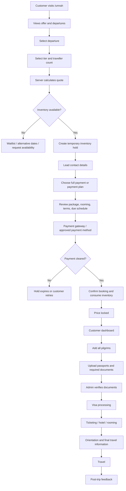
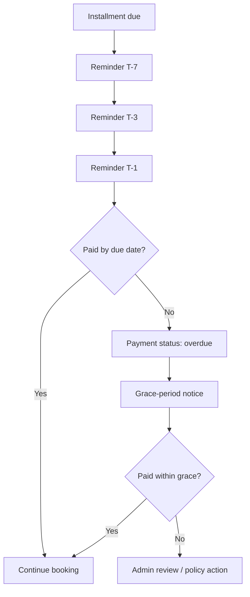
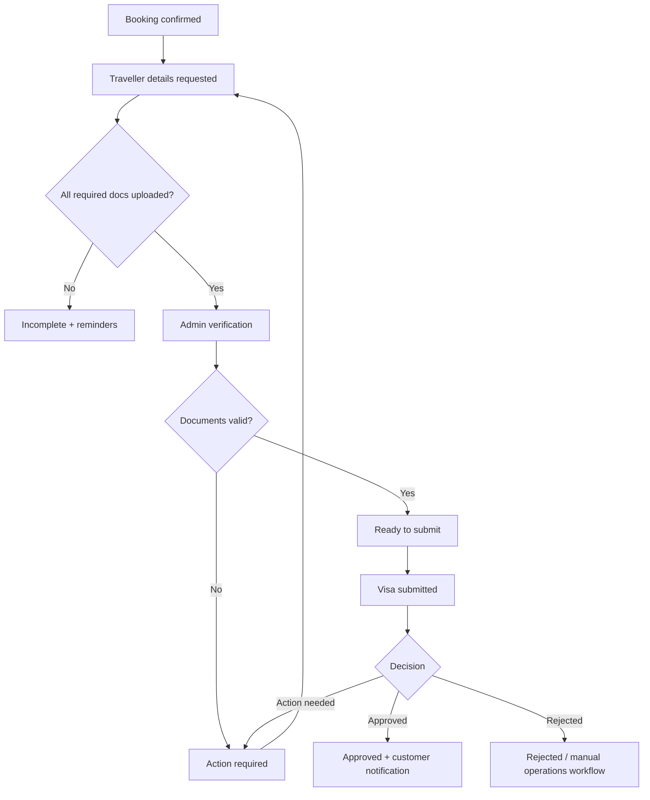
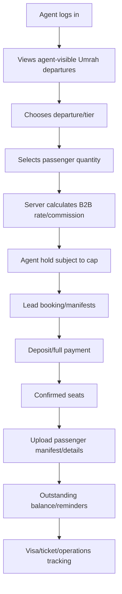
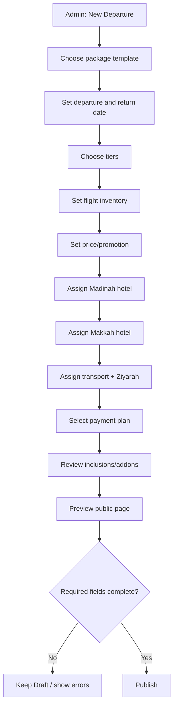
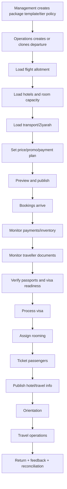

# GoGlobia Umrah Service Redesign

**Business Requirements Document + Product Specification + Engineering Specification + Seed Data**  
**Version:** 1.1  
**Date:** 8 September 2026  
**Prepared for:** GoGlobia Engineering, Product, Operations, Finance, Customer Support and Management  
**Primary public page:** https://goglobia.com/umrah  
**Current admin module:** https://goglobia.com/admin/settings/modules#umrah  
**Current module ID:** 35  
**Module type/provider:** `umrah` / `umrah`  
**Environment:** Production  
**Support WhatsApp:** +234 912 854 3573  
**Support email:** hi@goglobia.com

---

## 1. Purpose of This Document

This document defines the complete redesign of the GoGlobia Umrah service so that the public website, checkout, customer dashboard and admin back office work as one purpose-built Umrah operating system.

The objective is to replace the current generic travel-search style experience with a managed group-departure experience where customers can immediately understand:

- what package is available;
- what month/date they can travel;
- how many days the trip lasts;
- how many nights are in Madinah and Makkah;
- what is included;
- the package tier;
- the actual selling price;
- current availability;
- whether they can pay in full or by installment;
- how much is required to lock the price;
- what documents they need after booking;
- the status of their visa, flight, hotel, rooming and payment;
- how to contact GoGlobia.

At the same time, GoGlobia administrators must be able to manage packages, departures, prices, seat inventory, hotels, room allocations, transport, payment plans, travellers, passports/documents, visa status, ticketing, notifications and group operations without requiring an engineer for ordinary daily changes.

---

## 2. Confirmed Business Decisions From the Product Discussion

These are the decisions that should be treated as the current source of truth for the first production release.

### 2.1 Current Normal Umrah product

| Field | Production decision |
|---|---|
| Product | GoGlobia Normal Umrah – 14 Day |
| Season | Normal Umrah |
| Current live tier | Standard Economy |
| Promotional selling price | **₦2,490,000 flat per pilgrim** |
| Previous / regular price | **₦2,800,000** |
| Advertised saving | **₦310,000** |
| Madinah stay | **4 nights** |
| Makkah stay | **10 nights** |
| Marketing duration label | **14-Day Umrah** |
| Standard rooming | Shared economy accommodation, normally **4–5 pilgrims per room** |
| Departure months | October, November and December 2026 |
| Recurring dates | **12th and 28th** of each month |
| Currency | NGN |
| Public price model | Direct all-in package selling price |
| Deposit/payment plan | Enabled |
| Price lock | Triggered by cleared qualifying payment and confirmed inventory |

### 2.2 Departures to seed

| Month bucket | Departure | Return | Price | Status |
|---|---:|---:|---:|---|
| October 2026 | 12 Oct 2026 | 26 Oct 2026 | ₦2,490,000 | Publish after inventory confirmation |
| October 2026 | 28 Oct 2026 | 11 Nov 2026 | ₦2,490,000 | Publish after inventory confirmation |
| November 2026 | 12 Nov 2026 | 26 Nov 2026 | ₦2,490,000 | Publish after inventory confirmation |
| November 2026 | 28 Nov 2026 | 12 Dec 2026 | ₦2,490,000 | Publish after inventory confirmation |
| December 2026 | 12 Dec 2026 | 26 Dec 2026 | ₦2,490,000 | Publish after inventory confirmation |
| December 2026 | 28 Dec 2026 | 11 Jan 2027 | ₦2,490,000 | Publish after inventory confirmation |

> **Important modelling rule:** flight dates, marketing duration and contracted hotel nights are separate fields. Never calculate hotel nights by subtracting the return date from the departure date. The package is marketed as 14-Day Umrah while the business separately stores 4 Madinah nights and 10 Makkah nights.

### 2.3 Standard Economy inclusions

The Standard Economy package currently includes:

1. Return economy flight ticket.
2. Saudi Umrah visa.
3. Four nights accommodation in Madinah.
4. Ten nights accommodation in Makkah.
5. Airport transfers.
6. Madinah → Makkah transportation.
7. Makkah Ziyarah.
8. Madinah Ziyarah.
9. Free Saudi Zain SIM.
10. Free GoGlobia eSIM.
11. Complimentary 1GB data.
12. Discounted additional data top-ups.
13. Nusuk registration assistance.
14. Free GoGlobia Umrah gift kit.
15. Yahaji 3 Pro Faith & Health Ring.
16. Dedicated group coordination.
17. 24/7 WhatsApp travel support.
18. Pre-departure Umrah orientation and guidance.

Public package cards should show only the strongest 6–8 benefits above the fold. The full list should appear on the detail page under **Everything Included**.

---

## 3. Product Vision

The Umrah service should behave like a managed departure product, not like a generic flight/hotel search engine.

A customer arriving from Instagram, WhatsApp, TikTok, Google or a QR code should immediately see the current commercial offer rather than first having to understand a complicated search form.

### Release objective

> Replace the current generic Umrah search/detail experience with a purpose-built, inventory-aware, payment-plan-enabled Umrah booking system that GoGlobia operations can manage without engineering intervention.

### Core principles

- Mobile first.
- Package first, search second.
- Real departures, not arbitrary dates.
- All-in transparent pricing.
- Live inventory with proper server-side holds.
- Deposit/price-lock support.
- Low-friction initial checkout.
- Full pilgrim/passport information collected after price lock when appropriate.
- Separate booking/payment/document/visa/ticket/rooming statuses.
- Admin self-service.
- One inventory pool shared correctly across B2C and agents unless explicitly separated.
- Complete audit trail for price, capacity, payment and traveller changes.

---

## 4. Current State and What Must Change

The current Umrah module configuration contains:

- Module Status: Active / Inactive.
- Pricing Configuration.
- Markup Type B2B: Percentage or Fixed Amount.
- B2B Markup Value.
- Markup Type B2C: Percentage or Fixed Amount.
- B2C Markup Value.
- Tax Type: Percentage or Fixed Amount.
- Tax Value.
- Module ID: 35.
- Type: umrah.
- Provider: umrah.
- Environment: Production.

This configuration is too small for a managed Umrah product. It can remain as the **General/Price Engine** foundation, but must be expanded significantly.

### Current public-flow issue

The current public Umrah area has behaved like a generic search product using fields such as:

- Destination;
- Start Date;
- Duration;
- Umrah Type;
- Services.

The Umrah experience should instead revolve around actual GoGlobia group departures.

### Current detail-page issue

A package detail route supplied during the discussion used a structure similar to:

`/umrah/detail/ramdan-umrah/9/umrah/11-09-2026/any/1-0`

The new architecture must not depend on fragile dates or slugs that can result in an empty/error detail page.

### Keep/change mapping

| Current element | Decision | New behaviour |
|---|---|---|
| Destination | Change | Makkah/Madinah are inherent to Umrah; do not make destination the primary search concept. |
| Start Date | Keep but simplify | Show actual published departure dates/cards. |
| Duration | Keep as package attribute | Display “14-Day Umrah”; separately store 4 Madinah + 10 Makkah nights. |
| Umrah Type | Improve | Season/category: Normal, Ramadan, future special products. |
| Services | Move | Present inclusions clearly; optional services become addons/upgrades. |
| Generic detail route | Replace | Stable package slug/ID + selected departure ID/query. |
| Global B2C markup | Fallback only | Direct package selling price must override global markup. |
| Global B2B markup | Fallback only | Departure/tier B2B rate or commission should override global markup. |

---

## 5. Roles and Personas

### 5.1 Public visitor

Can browse packages, compare departures/tiers, view inclusions, see price and availability, request a quote, join a waitlist or begin booking.

### 5.2 Logged-in customer / pilgrim lead

Can pay, complete traveller records, upload documents, view payment balance, visa/ticket/hotel status, rooming information, trip documents, announcements and support.

### 5.3 B2B agent

Can use permitted agent rates/commission, reserve multiple pilgrims, upload manifests, pay deposits/balances and track group readiness.

### 5.4 Sales/customer-support staff

Can search bookings, assist customers, create assisted bookings where permitted, view payment and document status, add internal notes and communicate with customers.

### 5.5 Umrah operations staff

Can manage traveller readiness, rooming, hotels, transport, Ziyarah, visas, ticketing, manifests and group coordination.

### 5.6 Finance staff

Can see amounts paid/outstanding/overdue, verify manual payments, process approved refunds, reconcile gateway transactions and export finance reports.

### 5.7 Umrah manager/admin

Can create/edit package templates, tiers, departures, prices, promotions, inventory, payment plans, addons and operational allocations.

### 5.8 Super admin

Can configure module-wide policy, permissions, provider settings, currency/tax/markup and sensitive overrides.

---

# PART A — PACKAGE AND COMMERCIAL MODEL

## 6. Recommended Product Hierarchy

Use the following hierarchy:

```text
Umrah Module
└── Season / Category
    ├── Normal Umrah
    ├── Ramadan Umrah
    └── Future Special Season
         └── Package Template
              └── Package Tier
                   └── Departure
                        └── Booking
                             └── Travellers
```

### Definitions

**Season**  
Normal, Ramadan or future special period.

**Package Template**  
Reusable definition such as `Normal Umrah – 14 Day` containing duration label, 4 Madinah nights, 10 Makkah nights, base itinerary and standard features.

**Tier**  
Standard Economy, VIP Comfort, VVIP Premium, VVVIP Executive or VVVVIP Luxury.

**Departure**  
An actual saleable movement with exact departure/return dates, flight allotment, hotels, capacity, price, promotion, booking deadline, transport and availability.

**Booking**  
A customer reservation against one departure and one tier.

**Traveller**  
One pilgrim attached to a booking.

### Why this matters

Do not create a completely separate package record every time GoGlobia changes a departure date. The reusable package template should be separated from departure inventory.

---

## 7. Package Tier Architecture

The system must support all five business labels immediately even if only Standard Economy has live pricing.

| Internal code | Public label | Default rooming | Positioning | Initial booking mode |
|---|---|---|---|---|
| `standard` | Standard Economy | 4–5 sharing | Value/economy group package | **Instant booking** |
| `vip` | VIP Comfort | Quad sharing | Better hotel/location/comfort | Request quote until priced |
| `vvip` | VVIP Premium | Triple sharing | Premium hotel/closer location | Request quote until priced |
| `vvvip` | VVVIP Executive | Double sharing | Executive 4/5-star equivalent | Request quote until priced |
| `vvvvip` | VVVVIP Luxury | Private single/double | Luxury hotel/private/priority service | Request quote until priced |

### Public naming recommendation

Keep the backend codes exactly as the business wants, but show descriptive suffixes on the public website. This makes comparison easier than displaying only a wall of repeated “V” letters.

### Tier activation rule

A tier can be:

- Active and Bookable.
- Active but Request Quote.
- Draft.
- Hidden.
- Sold Out.
- On Request.

A premium tier must not show a fake numeric price until its supplier cost, hotels and capacity are configured.

---

## 8. Pricing Rules

### 8.1 Direct Standard Economy price

Current B2C direct public price:

**₦2,490,000 per pilgrim**

Regular/old price:

**₦2,800,000**

Savings:

**₦310,000 (approximately 11.07%)**

### 8.2 Price precedence

Use this order:

1. Departure-tier direct promotional price.
2. Departure-tier direct regular price.
3. Tier/package direct price.
4. Cost + package markup.
5. Module global markup fallback.

Tax is applied only when explicitly enabled and must be disclosed in the all-in total.

### 8.3 Critical pricing rule

The current Standard Economy campaign is already an intentional **₦2,490,000 flat selling price**. The existing global B2C markup must not add another percentage on top of it.

### 8.4 Recommended module pricing defaults

```yaml
pricing_mode: direct_sell_price
currency: NGN
b2c_global_markup: 0
b2b_global_markup: 0
tax_enabled: false
price_display: all_inclusive
```

Finance may enable tax later, but the customer must never discover surprise charges at the payment page.

---

## 9. Promotions

Each departure-tier should support:

- regular price;
- promo price;
- promo start;
- promo end;
- promo seat allocation;
- optional promo code;
- savings amount;
- savings percentage;
- campaign label such as `Early Bird`, `Launch Offer` or `Limited Promotion`;
- whether promo can be used with addons/agent discounts;
- price history.

### Promotion expiry behaviour

If a customer has a valid checkout hold created while a promotion is active, the server-side quote remains valid until the quote/hold expires. A browser refresh must not create a different amount inside the valid quote window.

A promotion is **not** permanently locked until the qualifying payment clears.

---

# PART B — CUSTOMER WEBSITE EXPERIENCE

## 10. `/umrah` Landing Page

### Mobile-first rule

> Do not begin with a large multi-field search form. Most social/WhatsApp/QR visitors already know they are looking for GoGlobia Umrah. Put the current offer, package months and booking CTA immediately on screen.

### 10.1 Recommended page order

#### Section 1 — Hero

Suggested content:

**GoGlobia Umrah 2026**  
**October • November • December**  
**Standard Economy – ₦2.49M**  
~~₦2.8M~~ **Save ₦310,000**

Supporting line:

> A well-organised 14-day Umrah journey with flights, visa, 4 nights in Madinah, 10 nights in Makkah, transportation, Ziyarah, connectivity and dedicated GoGlobia support.

Primary CTA:

**View Departures**

Secondary CTA:

**Chat on WhatsApp**

Quick benefit row:

- Flight.
- Visa.
- 4 Madinah + 10 Makkah.
- Ground transportation.
- Makkah & Madinah Ziyarah.
- Zain SIM + GoGlobia eSIM/1GB.
- GoGlobia kit + Yahaji 3 Pro Ring.
- 24/7 support.

#### Section 2 — Choose your departure

Group departure cards by month.

Each card shows:

- month;
- departure date;
- return date;
- `14-Day Umrah` label;
- Standard Economy tier;
- current promo price;
- old price/saving where applicable;
- availability label;
- rooming basis;
- CTA.

Example:

```text
12 OCT → 26 OCT 2026
14-Day Normal Umrah
Standard Economy
₦2,490,000
Shared 4–5 rooming
[Available]
[View Package] [Book Now]
```

#### Section 3 — Package tiers

Show comparison cards for:

- Standard Economy.
- VIP Comfort.
- VVIP Premium.
- VVVIP Executive.
- VVVVIP Luxury.

Only tiers with valid price/capacity show **Book Now**.

Unpriced tiers show:

**Request Quote / Check Availability**

#### Section 4 — What is included

Show the complete Standard inclusions grouped into:

- Flight & Visa.
- Hotels.
- Transportation.
- Ziyarah.
- Connectivity.
- Pilgrim Gifts.
- Guidance & Support.

#### Section 5 — Stay & itinerary

Visual timeline:

```text
Nigeria → Saudi Arabia
       ↓
Madinah — 4 nights
       ↓
Madinah → Makkah transfer
       ↓
Makkah — 10 nights
       ↓
Airport → Nigeria
```

#### Section 6 — Payment plan

Explain that customers can pay in full or secure the promotional price with the qualifying payment plan, subject to departure timing and inventory.

#### Section 7 — How booking works

1. Choose departure and package tier.
2. Choose traveller count.
3. Pay in full or make the required price-lock payment.
4. Receive booking confirmation/reference.
5. Complete pilgrim/passport details in dashboard.
6. GoGlobia processes travel arrangements.
7. Attend pre-departure orientation.
8. Travel with the group.

#### Section 8 — FAQ

Minimum FAQs:

- What does ₦2.49m include?
- Is accommodation shared?
- How many people share a room?
- Can a family stay together?
- Can I pay a deposit?
- Does the deposit lock the price?
- When is the balance due?
- What documents are required?
- Is the visa guaranteed?
- What happens if a departure sells out?
- Can I change my date?
- What are cancellation/refund rules?
- Are children allowed and how are they priced?
- When will hotel names be confirmed?
- Is Makkah/Madinah Ziyarah included?
- Do I receive a SIM/eSIM?
- What is in the GoGlobia Umrah kit?
- What is the Yahaji 3 Pro ring?
- How does Nusuk assistance work?
- How do I contact support?

#### Section 9 — Trust/support

- WhatsApp: +234 912 854 3573.
- Support email: hi@goglobia.com.
- Current verified licences/accreditations only.
- Customer support assurance.

Do not show expired/unverified badges.

---

## 11. Search and Filtering

The landing page may still offer filters below the hero.

| Filter | Behaviour |
|---|---|
| Departure | October / November / December or exact published departure |
| Package tier | Standard / VIP / VVIP / VVVIP / VVVVIP |
| Origin | Only show if different origin fares exist |
| Travellers | Customer seat count; must respect inventory |
| Room preference | Shared / family-together request / upgrade request |

Destination does not need to be a primary filter because Makkah and Madinah are intrinsic to this product.

---

## 12. Package Detail Page

### Recommended canonical URLs

Preferred options:

```text
/umrah/packages/normal-umrah-14-day
```

or

```text
/umrah/packages/{packageId}/{slug}
```

Selected departure can be represented by:

```text
?departure={departureId}
```

or a stable departure route.

### Legacy handling

Old Umrah URLs should redirect to the nearest valid package/departure where possible.

A stale date/slug must never result in a generic blank/error page when the package still exists.

### Required detail-page sections

| Section | Required content |
|---|---|
| Hero | Package name, tier, promo price, old price, savings, duration, selected departure, availability, CTA |
| Departure selector | All active dates grouped by month; date switching updates price/availability without breaking page |
| Inclusions | Full Standard Economy feature list |
| Stay & itinerary | 4 nights Madinah → 10 nights Makkah |
| Flight | Show only confirmed real data |
| Hotels | Show real assigned hotels only; otherwise “hotel details being finalised” according to policy |
| Rooming | Shared economy, normally 4–5 pilgrims per room; gender/family rules |
| Payment plan | Full payment and exact installment amounts/deadlines |
| Addons | Only active real addons |
| Important info | Documents, deadline, supplier/cancellation rules, child policy |
| Support | WhatsApp and email |
| Sticky booking card | Departure, tier, pax, amount due now, Continue Booking |

### Availability language

Do not show a random fake urgency number.

Recommended display:

- Available.
- Limited Seats.
- Sold Out.
- Join Waitlist.
- Request Availability.
- Bookings Closed.

Exact remaining seat counts should be configurable.

---

# PART C — COMPLETE CUSTOMER BOOKING FLOW

## 13. High-Level Customer Flowchart



---

## 14. Detailed Booking Wizard

### Step 1 — Select package

Customer chooses:

- departure;
- tier;
- traveller count;
- room preference/request;
- available addons if desired.

System shows:

- live package price;
- old/promo price;
- total for all travellers;
- availability;
- rooming basis;
- amount required now;
- payment-plan eligibility.

### Step 2 — Server-side quote

The browser sends selected parameters to the server.

Server creates a quote containing:

- quote ID;
- departure ID;
- tier;
- traveller count;
- room preference;
- selected addons;
- unit price;
- total price;
- amount due now;
- promotion used;
- quote expiry;
- cancellation/policy version.

The client must never be trusted to calculate the final payable amount.

### Step 3 — Inventory hold

When the customer proceeds to checkout, create a server-side inventory hold.

Recommended default:

**20 minutes**

A countdown may be displayed only if the hold actually exists on the server.

### Step 4 — Lead contact

Before the first payment, require only what is needed to secure and communicate about the booking:

- lead traveller/customer name;
- email;
- WhatsApp/phone;
- number of travellers;
- basic room preference.

Optionally verify phone/email.

### Friction-reduction rule

Do **not** force a family booking five seats to complete five passports before they can secure the promotional price.

Take the qualifying payment first, confirm the booking, then give the customer a clear deadline to complete all pilgrim details/documents in the dashboard.

### Step 5 — Payment choice

Options:

- Pay in Full.
- Price Lock Installment Plan.

Show exact amount due now and every future payment deadline.

### Step 6 — Review

Customer must see and acknowledge:

- selected departure;
- return date;
- tier;
- traveller count;
- total price;
- amount due today;
- future installment amounts;
- rooming basis;
- itinerary;
- inclusions;
- exclusions;
- active addons;
- cancellation/refund rules;
- booking-change rule;
- passport/document deadline;
- terms and conditions.

### Step 7 — Payment

Use configured gateway or approved payment method.

Requirements:

- server creates payment intent/reference;
- never trust browser success alone;
- payment webhook verifies with gateway;
- webhook is idempotent;
- duplicate webhook cannot create two bookings or consume seats twice;
- amount/currency must match expected installment;
- payment reference stored;
- gateway payload logged safely without leaking sensitive card data.

### Step 8 — Confirmation

After a cleared qualifying payment:

Show:

- booking reference;
- `Confirmed` state;
- price-locked badge/time;
- departure/return;
- tier;
- traveller count;
- amount paid;
- balance;
- next due date;
- next amount;
- `Complete Traveller Details` CTA;
- support WhatsApp;
- receipt.

### Step 9 — Customer dashboard

Customer completes traveller and document information after booking.

---

# PART D — PAYMENT PLAN, DEPOSIT AND PRICE LOCK

## 15. Recommended Installment Plan

### Standard Economy — ₦2,490,000

| Stage | Percentage | Amount | Default rule |
|---|---:|---:|---|
| Deposit / Price Lock | 50% | **₦1,245,000** | At booking |
| Installment 2 | 25% | **₦622,500** | 45 days before departure |
| Final balance | 25% | **₦622,500** | 21 days before departure |
| Total | 100% | **₦2,490,000** | — |

No interest or finance charge is added by GoGlobia for this plan unless management later creates a different commercial product.

## 16. Booking Timing Rule

| Time until departure | Required at booking | Balance |
|---|---:|---|
| More than 45 days | 50% = ₦1,245,000 | 25% at T-45, 25% at T-21 |
| 22–45 days | 75% = ₦1,867,500 | 25% at T-21 |
| 21 days or less | 100% = ₦2,490,000 | None |

The payment service should compute this dynamically from the selected departure and current date.

## 17. Price-Lock Rule

> The promotional package price is locked only when the required qualifying payment has cleared and the seat has been confirmed.

A 20-minute checkout hold is not a permanent price lock.

If the customer later changes:

- departure;
- tier;
- room occupancy;
- origin fare;
- addon;
- another price-affecting component;

then the changed component is repriced under the applicable rules.

## 18. Grace Period and Overdue Handling

Recommended default:

**72-hour installment grace period**

Flow:



Do not automatically destroy a confirmed pilgrimage booking without applying the configured package/supplier policy and allowing operations/finance review where necessary.

## 19. Refund and Cancellation Rule

Do not hardcode a statement that the entire deposit is always non-refundable.

Store cancellation rules for components such as:

- flight;
- hotel;
- visa;
- ground transport;
- special supplier service;
- GoGlobia administration where legally/commercially applicable.

At checkout, show the package cancellation terms applying to the selected departure.

When a refund request is raised:

1. Identify supplier commitments already made.
2. Calculate refundable/non-refundable components.
3. Apply package terms.
4. Route complex cases to manual review.
5. Store calculation and approval history.
6. Update payment/refund status separately from booking status.

---

# PART E — INVENTORY AND AVAILABILITY

## 20. Inventory Model

Each departure has a **shared flight seat pool**.

Package tiers consume that pool, while each tier can additionally be constrained by:

- tier sales cap;
- hotel bed/room capacity;
- transport capacity if explicitly enforced;
- visa/service cap;
- supplier allotment.

### Bookable-seat formula

```text
Bookable seats = MIN(
    remaining flight seats,
    remaining tier sales capacity,
    remaining hotel bed capacity,
    remaining configured visa/service capacity
)
```

### Inventory states

| State | Meaning | Public display |
|---|---|---|
| Available | Above low-stock threshold | Available |
| Low stock | At/below threshold, default 10 | Limited Seats |
| Held | Temporary checkout reservation | Not available to others |
| Reserved | Deposit/full qualifying payment cleared | Consumed |
| Sold out | No capacity | Sold Out / Join Waitlist |
| On request | Capacity not instantly confirmable | Request Availability |
| Closed | Deadline/admin close | Bookings Closed |

## 21. Inventory Engineering Rules

- Use database transactions/row locks or equivalent atomic inventory operations.
- Expire unpaid holds automatically.
- Never decrement inventory based only on browser state.
- Payment webhooks must be idempotent.
- Admin may increase/decrease allotment with audit trail.
- Admin may not reduce capacity below existing confirmed bookings without a dedicated supervised exception workflow.
- Displayed availability must be derived from the same inventory source used at checkout.
- B2C and B2B should use the same pool unless management explicitly allocates separate agent inventory.

## 22. Waitlist

When sold out, customer may join a waitlist with:

- name;
- WhatsApp;
- email;
- requested traveller count;
- preferred tier;
- acceptable alternative dates.

If inventory is released, notify waitlisted customers according to queue/business rules.

A waitlist notification does not itself reserve inventory unless a hold is created.

---

# PART F — CUSTOMER DASHBOARD AFTER BOOKING

## 23. Dashboard Structure

| Widget / tab | Customer view/action |
|---|---|
| Trip card | Booking reference, departure, return, tier, countdown, booking status |
| Payment progress | Amount paid, balance, next due amount/date, Pay Now, receipts |
| Traveller progress | Each pilgrim: incomplete / document missing / ready |
| Documents | Upload passport/photo and configured document types |
| Visa | Not started / documents ready / submitted / approved / action required |
| Flight | Airline/PNR/e-ticket only when real/issued |
| Hotels | Madinah/Makkah property information once confirmed |
| Rooming | Room request and final assignment when operations confirms |
| Trip materials | Orientation, guide, kit, SIM/eSIM activation info |
| Announcements | Group updates |
| Support | One-tap WhatsApp and customer care |

## 24. Traveller Information Flow

### Before payment

Require:

- lead contact name;
- email;
- WhatsApp/phone;
- number of travellers;
- basic room request.

### After deposit/confirmation

For every pilgrim collect:

- title if needed;
- legal first/middle/last names;
- gender;
- date of birth;
- nationality;
- passport number;
- passport issue date if needed;
- passport expiry;
- passport bio-page image/file;
- passport photo if required;
- emergency contact;
- relationship/group/family reference;
- rooming preference;
- ring size if GoGlobia requires it for the Yahaji 3 Pro distribution;
- all admin-configured visa fields.

### Before visa submission

All mandatory fields/documents must be verified by authorised staff.

Health/vaccination document requirements must be configurable in admin rather than hardcoded into source code.

### Before departure

Customer dashboard should expose:

- approved visa/document;
- ticket once issued;
- hotel information;
- meeting point;
- group/bus information;
- orientation details;
- luggage/flight guidance;
- kit distribution status;
- eSIM/SIM information;
- emergency/support contact.

---

## 25. Document Security

Passport and identity records are high-sensitivity data.

Required controls:

- encrypted HTTPS transport;
- encrypted storage where supported;
- private object/file storage;
- signed and expiring file-access URLs;
- no public storage path;
- role-based access;
- audit every document view/update where practicable;
- prevent agents from viewing unrelated customers;
- customer may access only authorised booking travellers;
- staff permissions separated by role;
- do not log passport images/base64 in ordinary application logs;
- retention/deletion rules should align with GoGlobia legal/data-protection requirements.

---

# PART G — ROOMING AND GROUP MANAGEMENT

## 26. Standard Rooming Rule

Standard Economy price is based on shared accommodation, normally:

**4–5 pilgrims per room.**

### Important allocation rules

- Track gender.
- Track family groups.
- Do not automatically mix unrelated male and female pilgrims in one room.
- Allow `Travel Together` / `Same Room Group` requests.
- Treat those as requests until operations confirms.
- If requested lower occupancy requires additional room cost, create a paid room upgrade/addon or move customer to the appropriate tier.

## 27. Rooming Board

Admin rooming interface should display:

- city;
- hotel;
- room type;
- room number/reference;
- capacity;
- current occupants;
- gender/family flags;
- unassigned travellers;
- special notes.

Recommended UX:

- drag/drop assignment;
- auto-suggest compatible rooms;
- warn on overcapacity;
- warn on male/female conflict;
- show family group;
- filter unassigned;
- export rooming list to Excel/PDF;
- export supplier manifest.

---

# PART H — VISA, TICKETING, HOTEL AND TRAVEL OPERATIONS

## 28. Independent Status Model

Do not use one giant `booking_status` for every operational concept.

| Domain | Recommended states |
|---|---|
| Booking | draft, held, confirmed, cancelled, completed |
| Payment | unpaid, deposit_paid, partially_paid, fully_paid, overdue, refund_pending, refunded |
| Traveller documents | not_started, incomplete, ready, verified, action_required |
| Visa | not_started, ready_to_submit, submitted, approved, rejected, action_required |
| Ticket | not_started, reserved, ticketed, changed, cancelled |
| Rooming | unassigned, requested, assigned, confirmed |
| Travel | predeparture, checked_in, in_trip, returned |

This allows staff to answer questions such as:

- Seat confirmed, but visa pending.
- Fully paid, but documents missing.
- Visa approved, ticket not yet issued.
- Ticket issued, rooming still unassigned.

## 29. Visa Case Flow



## 30. Ticketing Flow

1. Departure has group flight allocation.
2. Booking consumes seat inventory after qualifying payment.
3. Passenger names become complete/verified.
4. Ticketing team reserves/assigns passenger details.
5. Ticket status becomes `reserved`.
6. E-ticket/PNR becomes available.
7. Status becomes `ticketed`.
8. Customer receives ticket notification.
9. Changes/cancellations keep separate audit/status.

Do not display placeholder airline/PNR data to customers.

## 31. Hotel Operations

For each departure/tier, admin sets:

### Madinah allocation

- hotel;
- supplier;
- property/category;
- four nights;
- check-in/out;
- room types;
- room count/bed capacity;
- supplier cost;
- confirmation/reference;
- distance/location note;
- contact.

### Makkah allocation

Same fields, with ten nights.

Exact hotel details shown publicly/customer dashboard only according to management policy and once sufficiently confirmed.

## 32. Ground Transport

Admin can assign services such as:

- arrival airport → Madinah hotel;
- Madinah Ziyarah;
- Madinah → Makkah;
- Makkah Ziyarah;
- Makkah → departure airport;
- future private transfer;
- future train upgrade.

Store:

- supplier;
- contact;
- vehicle type;
- vehicle capacity;
- service route;
- cost;
- group/bus number;
- driver/contact when known;
- status.

---

# PART I — AUTOMATED CUSTOMER COMMUNICATION

## 33. Notification Triggers

| Trigger | Recommended message |
|---|---|
| Checkout hold created | Amount due now + real hold expiry |
| Payment confirmed | Price locked + seat confirmed + booking reference |
| Traveller details incomplete | Missing items + dashboard link |
| Installment due | T-7, T-3, T-1 reminders |
| Overdue | Grace-period notice / contact support |
| Visa submitted | Visa submitted update |
| Visa approved | Approval update |
| Visa action required | Exact missing/action item |
| Ticket issued | Flight summary + baggage + ticket link |
| Hotels confirmed | Madinah/Makkah information |
| Orientation scheduled | Date/time/location/link |
| 7 days before travel | Checklist, luggage, meeting point, support |
| 24 hours before travel | Final meeting time + group coordinator |
| During trip | Bus/Ziyarah/group announcements |
| After return | Feedback/review request |

Channels can include:

- Email.
- WhatsApp where integration/consent permits.
- In-app/dashboard notifications.
- SMS as future fallback.

## 34. Example Payment Confirmation Message

```text
Assalamu Alaikum {{customer_name}},

Your GoGlobia Umrah booking {{booking_reference}} has been confirmed.

Departure: {{departure_date}}
Package: {{tier_name}}
Travellers: {{traveller_count}}
Amount Paid: {{amount_paid}}
Balance: {{balance}}
Next Payment: {{next_amount}} due {{next_due_date}}

Your qualifying payment has locked the confirmed package price for this booking, subject to any customer-requested changes.

Next step: complete each pilgrim's details and documents here:
{{dashboard_link}}

Support: +234 912 854 3573
GoGlobia
```

---

# PART J — ADDONS AND UPGRADES

## 35. Recommended Addon Architecture

Current/recommended addon templates:

| Code | Addon | Pricing model | Initial state |
|---|---|---|---|
| ROOM_UPGRADE | Room occupancy upgrade | per pilgrim / per room | Active |
| EXTRA_ESIM_DATA | Discounted extra eSIM data | per pilgrim | Active |
| HARAMAIN_TRAIN | Haramain train upgrade | per pilgrim | Disabled until contracted |
| PRIVATE_TRANSFER | Private airport/intercity transfer | per booking | Disabled until contracted |
| EXTRA_BAGGAGE | Additional baggage | per pilgrim | Disabled until real price available |
| OPTIONAL_TOUR | Taif/Jeddah/approved optional tour | per pilgrim | Disabled until available |
| TRAVEL_INSURANCE | Travel insurance | per pilgrim | Disabled until available |

### Addon rule

Do not display an addon unless price/availability/terms are real.

### Room upgrades

Examples:

- Standard 4–5 sharing included.
- Quad supplement.
- Triple supplement.
- Double supplement.
- Single/private supplement.

The exact price is departure/tier/hotel-specific and should be set in admin.

---

# PART K — B2B / TRAVEL AGENT FLOW

## 36. Agent Flow



### B2B rules

- Agents normally draw from the same departure inventory as B2C.
- Separate agent allotments only when management explicitly configures them.
- Departure-tier B2B net rate/commission overrides global B2B markup.
- Admin may cap agent holds.
- Agent hold timeout may differ from B2C.
- Agent can book multiple pilgrims.
- Agent can pay deposit and balance.
- Agent can upload passenger manifest.
- Agent sees its own booking/commission information.
- Customer-facing receipts/pages must not reveal internal agent margin.
- Reports must show agent reference, seats, revenue and commission.

---

# PART L — ADMIN EXPERIENCE

## 37. Admin Design Principle

The admin panel should be easy enough that normal October/November/December departures can be created, cloned, priced and published without a code release.

### Existing page

Current location:

`/admin/settings/modules#umrah`

Current Umrah Configuration page should become a richer configuration area rather than the only place Umrah is managed.

---

## 38. Recommended Admin Navigation

```text
Umrah
├── Dashboard
├── Package Templates
├── Departures
├── Flights
├── Hotels
├── Ground Transport
├── Bookings
├── Rooming
├── Visa Cases
├── Payments
├── Addons
├── Notifications
├── Reports
├── Configuration
└── Audit Log
```

---

## 39. Admin Configuration Tabs

Replace/extend the single configuration form with:

### General

- Module status.
- Environment/provider.
- Currency.
- Support WhatsApp.
- Support email.
- Default booking close rule.
- Low-stock threshold.
- Inventory hold timeout.
- B2C maximum travellers per booking.
- B2B maximum travellers per booking.

### Pricing

- Pricing mode: Direct Sell Price / Cost + Markup.
- B2C global markup fallback.
- B2B global markup fallback.
- Tax enabled/type/value.
- Public all-in price toggle.
- Price override precedence.

### Payments

- Full payment enable.
- Deposit plans enable.
- Default payment plan.
- Deposit percentage/fixed amount.
- Installment percentages.
- Due-day offsets.
- Grace period.
- Price-lock enabled.
- Gateways.
- Manual payment/bank transfer if management enables it.
- Manual verification roles.

### Inventory

- Managed inventory toggle.
- Prevent overbooking: default ON.
- Exact seat count display toggle.
- Low-stock threshold.
- Waitlist toggle.
- Overbooking policy: default OFF.

### Documents

- Required traveller fields.
- Required document types.
- Completion deadline.
- Verification roles.
- File requirements.

### Notifications

- Email enabled.
- WhatsApp enabled.
- Reminder offsets.
- Templates.

### B2B / Agents

- Agent package visibility.
- Net-rate/commission mode.
- Hold limits.
- Manifest support.
- agent-specific allocation if needed.

### Policies

- Terms URL/text.
- Cancellation matrix.
- Booking-change rules.
- Consent checkboxes.
- Document/privacy acknowledgement.

---

## 40. Admin Dashboard

Dashboard should answer operational questions immediately.

### Top cards

- Active departures.
- Seats sold today.
- Confirmed seats by departure.
- Available seats.
- Revenue booked.
- Cash collected.
- Outstanding balance.
- Overdue amount.
- Travellers missing details.
- Travellers missing documents.
- Visa pending/action required.
- Tickets outstanding.
- Unassigned rooming.

### Departure table

Columns:

- date;
- package;
- tier;
- capacity;
- confirmed;
- held;
- available;
- load factor;
- revenue;
- collected;
- outstanding;
- document readiness;
- visa readiness;
- ticket readiness;
- booking close;
- status;
- actions.

---

## 41. Admin Package Template Flow

### Create package template

Fields:

- internal code;
- slug;
- name;
- season;
- marketing duration label;
- Madinah nights;
- Makkah nights;
- itinerary order;
- default inclusions;
- exclusions;
- available tiers;
- rooming note;
- media/gallery;
- SEO title/description;
- active/draft.

Current initial template:

```text
Code: NORMAL-14D
Slug: normal-umrah-14-day
Name: GoGlobia Normal Umrah - 14 Day
Season: normal
Marketing duration: 14 days
Madinah: 4 nights
Makkah: 10 nights
Order: Madinah → Makkah
```

---

## 42. Admin “Create Departure” Wizard

### High-level flow



### Detailed steps

1. Choose template: `Normal Umrah – 14 Day`.
2. Select departure and return dates.
3. Option to bulk-create recurring 12th and 28th dates.
4. Select tiers. Standard preselected.
5. Set shared flight capacity/allotment.
6. Set booking-close date/time.
7. Set regular price.
8. Set promo price.
9. Set promo validity/allocation.
10. Assign Madinah hotel, 4 nights, room inventory.
11. Assign Makkah hotel, 10 nights, room inventory.
12. Assign ground transportation.
13. Assign Makkah/Madinah Ziyarah.
14. Select payment plan.
15. Configure price-lock rule.
16. Review inclusions.
17. Review addons.
18. Preview public page.
19. Publish.

### Publish validation

Production publication must fail if required fields are missing, including at minimum:

- package template;
- departure/return date;
- active tier;
- valid sell price for instant-book tier;
- currency;
- inventory/capacity or authorised on-request mode;
- payment rules;
- booking status/close rule.

Hotels may be allowed as `TBC` only if management intentionally permits this and customer copy is appropriate.

### Admin usability shortcut

Add:

- **Clone Departure**.
- **Bulk Create Recurring Departures**.

Operations should be able to generate all six Oct–Dec records in minutes.

---

## 43. Departures Admin Screen

Functions:

- filter by season/month/status/tier;
- view load factor;
- clone;
- bulk-create;
- edit dates;
- edit booking close;
- set direct prices;
- set promo;
- capacity adjustments;
- set available tiers;
- publish/unpublish;
- close bookings;
- waitlist enable;
- view connected flight/hotel/transport;
- view bookings;
- export manifest;
- audit changes.

---

## 44. Flights Admin

Fields:

- departure;
- airline;
- origin;
- destination/route;
- flight number if applicable;
- departure/arrival time;
- baggage;
- supplier;
- group PNR/reference;
- allotment;
- used seats;
- available seats;
- booking/ticketing deadline;
- supplier cost where authorised;
- operational notes;
- issue status.

---

## 45. Hotels Admin

Fields:

- hotel name;
- city;
- supplier;
- category/rating;
- distance/location note;
- contract/reference;
- contact;
- room types;
- occupancy;
- rooms/beds;
- cost;
- check-in/out;
- confirmation/reference;
- connected departures/tiers;
- status.

---

## 46. Ground Transport Admin

Fields:

- departure;
- route/service;
- vehicle type;
- vehicle capacity;
- supplier;
- contact;
- cost;
- schedule;
- bus/group number;
- driver/contact when available;
- notes;
- status.

---

## 47. Bookings Admin

Search/filter by:

- booking reference;
- customer name;
- WhatsApp;
- email;
- traveller name/passport where permissions allow;
- departure;
- tier;
- booking status;
- payment status;
- document status;
- visa status;
- ticket status;
- agent;
- balance due.

Booking detail should include:

- commercial summary;
- price lock history;
- payment schedule;
- receipts;
- traveller list;
- documents;
- visa/ticket status;
- rooming;
- addons;
- change/cancellation history;
- customer/admin notes;
- communication log;
- audit timeline.

---

## 48. Payments Admin

Functions:

- collected today;
- outstanding installments;
- due in 7/14/30 days;
- overdue;
- payment gateway reference;
- manual payment verification where enabled;
- receipts;
- refund request;
- refund approval workflow;
- reconciliation export;
- payment audit.

---

## 49. Visa Admin

Batch view by departure:

- passenger;
- passport readiness;
- missing docs;
- verified;
- ready to submit;
- submitted;
- approved;
- action required;
- rejected;
- notes;
- visa file/reference.

Support batch actions, but sensitive state changes must be permissioned/audited.

---

## 50. Ticket Admin

Batch view by departure:

- traveller;
- full name verification;
- ticket state;
- PNR;
- e-ticket;
- baggage;
- airline;
- issued date;
- change status;
- notes.

---

## 51. Notifications Admin

- templates;
- channel;
- audience;
- departure group;
- selected bookings/travellers;
- scheduled message;
- immediate send;
- preview;
- delivery status;
- delivery failure;
- opt-in/consent status where needed.

---

## 52. Reports

Minimum reports:

| KPI / report | Definition |
|---|---|
| Load factor | Confirmed paying seats / published capacity |
| Revenue | Booking value, cash collected, outstanding by departure |
| Payment exposure | Amount due 7/14/30 days and overdue |
| Document readiness | Complete vs missing |
| Visa readiness | Ready/submitted/approved/action-required |
| Ticketing readiness | Reserved/ticketed/outstanding |
| Rooming progress | Assigned/unassigned and occupancy exceptions |
| Agent performance | Seats/revenue/commission per B2B account |
| Conversion funnel | Detail view → quote → hold → payment → confirmation |
| Cancellation/refunds | Count/value/reasons/supplier loss |

Exports:

- CSV.
- Excel.
- PDF where appropriate.
- Supplier manifest.
- Passenger manifest.
- Rooming list.
- Payment receivables.

---

## 53. Audit Log

Audit at minimum:

- price changes;
- promo changes;
- inventory adjustments;
- booking changes;
- payment verification/refund;
- traveller identity changes;
- visa/ticket state changes;
- document verification;
- rooming changes;
- policy changes.

Record:

- actor;
- role;
- timestamp;
- entity;
- entity ID;
- old value;
- new value;
- reason where required;
- IP/session metadata where appropriate.

---

# PART M — END-TO-END ADMIN DAILY FLOW

## 54. Admin Operations Flowchart



## 55. Suggested Daily Admin Routine

### Sales/management

1. Check departure load factor.
2. Check available inventory.
3. Check promo/booking close dates.
4. Check waitlist.
5. Decide whether to open/close price tiers.

### Finance

1. Check payments collected.
2. Check due today.
3. Check upcoming 7-day receivables.
4. Check overdue/grace cases.
5. Reconcile manual/gateway transactions.

### Operations

1. Check missing passenger details.
2. Check missing/invalid passport documents.
3. Check visa cases.
4. Check ticketing.
5. Check rooming/unassigned passengers.
6. Check hotel and transport confirmations.
7. Send required group updates.

---

# PART N — DATA MODEL

## 56. Recommended Entities

| Table/entity | Key purpose/fields |
|---|---|
| `umrah_package_templates` | id, code, slug, season, name, marketing_duration, madinah_nights, makkah_nights, active |
| `umrah_tiers` | code, name, sort_order, rooming defaults, positioning, active, bookable |
| `umrah_departures` | template, dates, origin, status, booking close, shared flight capacity |
| `umrah_departure_tiers` | departure, tier, regular price, promo price/dates/allocation, tier capacity, booking mode |
| `umrah_features` | reusable inclusion/exclusion definitions |
| `umrah_package_features` | template/tier feature mapping and overrides |
| `umrah_hotels` | city, supplier, property, category, location note, contract ref |
| `umrah_hotel_allocations` | departure, tier, hotel, nights, room type, rooms/beds, cost, confirmation |
| `umrah_transport_allocations` | departure, route/service, vehicle, capacity, supplier, cost, contact |
| `umrah_bookings` | reference, customer, departure, tier, pax, total, price lock, statuses |
| `umrah_booking_travellers` | booking, legal identity, family/room group, readiness/status fields |
| `umrah_inventory_holds` | departure/tier, quote/booking/session, quantity, expiry, state |
| `umrah_payment_plans` | plan template/rules |
| `umrah_installments` | booking, sequence, amount, due date, status |
| `payments` | booking/installment, gateway ref, amount, state, webhook idempotency key |
| `umrah_documents` | traveller, type, private file ref, verification state |
| `umrah_room_assignments` | hotel allocation, room ref, traveller, state |
| `umrah_addons` | optional service, pricing and availability |
| `umrah_booking_addons` | booking/addon/quantity/price snapshot |
| `umrah_notifications` | booking/group, channel, template, delivery state |
| `umrah_price_history` | previous/new price, admin, reason, time |
| `umrah_audit_log` | full sensitive/admin action trail |

## 57. Important Snapshot Rule

A booking must retain snapshots of important commercial fields at confirmation time, including:

- selected unit price;
- total price;
- promotion;
- inclusions;
- rooming basis;
- payment plan;
- applicable terms/policy version.

Later editing the public package must not silently rewrite an existing customer's confirmed contract.

---

# PART O — API / SERVICE CONTRACT

## 58. Recommended Public/Customer APIs

| Method & route | Purpose |
|---|---|
| `GET /api/v1/umrah/departures` | Published departures/tiers/price/availability; month/tier/origin filters |
| `GET /api/v1/umrah/packages/{slug}` | Package template/detail/features |
| `GET /api/v1/umrah/departures/{id}` | Departure detail, tiers, itinerary, payment plans |
| `POST /api/v1/umrah/quotes` | Server-side quote |
| `POST /api/v1/umrah/holds` | Atomic checkout inventory hold |
| `POST /api/v1/umrah/bookings` | Create booking from valid quote/hold |
| `POST /api/v1/umrah/bookings/{id}/payments` | Initiate payment |
| `GET /api/v1/umrah/bookings/{id}` | Authorised customer/admin booking view |
| `PATCH /api/v1/umrah/bookings/{id}` | Authorised update |
| `POST /api/v1/umrah/bookings/{id}/travellers` | Add pilgrim records |
| `PATCH /api/v1/umrah/travellers/{id}` | Update pilgrim data |
| `POST /api/v1/umrah/travellers/{id}/documents` | Secure document upload |
| `POST /api/v1/umrah/waitlist` | Join sold-out/on-request waitlist |

## 59. Payment Webhook

```text
POST /api/v1/payments/webhook
```

Requirements:

- verify gateway signature;
- obtain gateway event/reference;
- apply idempotency key;
- verify payment amount/currency/reference;
- update payment/installment;
- confirm booking/consume held inventory when qualifying;
- release hold if definitively failed/expired according to policy;
- generate receipt;
- trigger notification;
- audit outcome.

## 60. Recommended Admin APIs

Examples:

```text
POST   /api/v1/admin/umrah/departures
POST   /api/v1/admin/umrah/departures/bulk
POST   /api/v1/admin/umrah/departures/{id}/clone
PATCH  /api/v1/admin/umrah/departures/{id}
PATCH  /api/v1/admin/umrah/departures/{id}/inventory
PATCH  /api/v1/admin/umrah/departures/{id}/pricing
POST   /api/v1/admin/umrah/hotel-allocations
POST   /api/v1/admin/umrah/transport-allocations
PATCH  /api/v1/admin/umrah/bookings/{id}
PATCH  /api/v1/admin/umrah/travellers/{id}/visa-status
PATCH  /api/v1/admin/umrah/travellers/{id}/ticket-status
POST   /api/v1/admin/umrah/rooming/assign
POST   /api/v1/admin/umrah/notifications/send
GET    /api/v1/admin/umrah/reports/*
```

All admin endpoints require role-based permissions.

---

# PART P — FRONT-END STATE AND UX DETAILS

## 61. Quote and Hold UI

When customer clicks `Book Now`:

1. Fetch fresh departure availability.
2. Generate server quote.
3. Display total.
4. Create hold only when customer proceeds to checkout.
5. If capacity changes before hold creation, show alternatives.
6. Hold timer should use server expiry, not a fake client timer.

## 62. Availability Change UX

If last seats disappear:

```text
Sorry, the requested number of seats is no longer available for this departure.

Available options:
• Reduce traveller count
• Choose another October/November/December date
• Join the waitlist
• Chat with GoGlobia
```

Never silently increase the price or reduce traveller count.

## 63. Payment Failure UX

If gateway payment fails:

- booking remains held only until remaining hold expiry;
- customer can retry;
- show no confirmation until verified payment;
- if customer was charged but webhook delayed, display `Payment verification in progress` rather than telling them to pay twice;
- operations/finance can reconcile later.

## 64. Booking Confirmation UX

Important visible content:

```text
Booking Confirmed
Reference: GGU-XXXXXXXX

October 12 – October 26, 2026
Standard Economy
5 Travellers

Total: ₦12,450,000
Paid: ₦6,225,000
Balance: ₦6,225,000
Next Payment: [amount/date]

Your confirmed package price is locked.

[Complete Traveller Details]
[View Booking]
[Chat on WhatsApp]
```

Figures above are illustrative for a five-person booking; the server must calculate actual values.

---

# PART Q — CUSTOMER-FACING COPY GUIDANCE

## 65. Hero Copy

```text
GoGlobia Umrah 2026
October • November • December

Standard Economy
₦2,490,000 Flat
Was ₦2,800,000 — Save ₦310,000

14-Day Umrah
4 Nights Madinah • 10 Nights Makkah

Flights, visa, accommodation, transportation, Ziyarah,
SIM/eSIM, pilgrim gifts and dedicated support included.

[View Departures] [Chat on WhatsApp]
```

## 66. Rooming Copy

```text
Standard Economy accommodation is based on shared rooms, normally 4–5 pilgrims per room. Room assignment is subject to gender and family configuration. Private/lower-occupancy room options may be available at an additional cost.
```

## 67. Price-Lock Copy

```text
Secure Your Price

Pay the required qualifying amount to confirm your seat and lock the current package price. Your required payment depends on how close your booking is to the departure date.
```

## 68. Premium Tier Copy

```text
VIP Comfort / VVIP Premium / VVVIP Executive / VVVVIP Luxury

Premium options are configured per departure based on hotel and service availability.
[Request Quote]
```

Do not invent luxury inclusions before management contracts them.

---

# PART R — EDGE CASES ENGINEERS MUST HANDLE

## 69. Mandatory Edge Cases

1. Two customers attempt to buy the last seats simultaneously.
2. Payment succeeds but the gateway webhook is delayed.
3. Same webhook is received twice.
4. Promotion ends while checkout quote/hold is active.
5. A multi-person booking requires an extra room due to gender/family rules.
6. Customer pays deposit, then requests another departure.
7. Customer changes tier.
8. One traveller cancels from a multi-person booking.
9. Supplier changes flight/hotel after booking.
10. Admin attempts to reduce capacity below confirmed passengers.
11. Customer misses installment deadline but is within grace period.
12. Customer remains unpaid after grace.
13. Visa process introduces a new required document without a code release.
14. Customer uploads unreadable/expired passport.
15. Package detail URL is stale.
16. Selected departure has been unpublished.
17. Customer has valid quote but inventory hold cannot be created.
18. Agent and B2C customer compete for the last seats.
19. Customer starts a second checkout for the same booking.
20. Payment gateway reports success but amount/currency mismatches.
21. Manual payment proof is uploaded but not verified.
22. Customer requests room upgrade after paying deposit.
23. Package price changes after a confirmed booking; existing booking must keep its snapshot except approved changes.
24. Admin changes feature list; historical confirmed booking must retain its booked feature snapshot.
25. Sold-out departure reopens due to released/cancelled inventory.

---

# PART S — SECURITY, PERMISSIONS AND RELIABILITY

## 70. Role-Based Permissions

Suggested permission groups:

- Umrah Configuration Admin.
- Package/Departure Manager.
- Pricing Manager.
- Finance.
- Customer Support.
- Documents/Visa Operations.
- Ticketing.
- Rooming/Hotel Operations.
- B2B Agent Manager.
- Reporting Read Only.

Sensitive actions should not automatically be available to all admin users.

## 71. Payment Reliability

- Gateway signature verification.
- Idempotent events.
- Immutable payment transaction records.
- Separate booking and payment states.
- Reconciliation job/report.
- Do not store raw card credentials.

## 72. Inventory Reliability

- Atomic hold/reserve/release.
- Expiry worker/job.
- Prevent negative capacity.
- Audit manual overrides.
- Availability API must be performant and authoritative.

## 73. Data Privacy

- Private passport/doc storage.
- Access logging.
- Least privilege.
- Do not expose customer data in URLs.
- Mask passport number in general admin tables where possible.
- Full passport details only in authorised view.

---

# PART T — SEO, ANALYTICS AND CONVERSION

## 74. SEO

Package template page should support:

- SEO title.
- Meta description.
- Open Graph image.
- canonical URL.
- structured data where appropriate.
- noindex for checkout/account/admin pages.

Example title:

`Umrah Packages from Nigeria 2026 | GoGlobia`

## 75. Analytics Funnel

Track at minimum:

```text
umrah_page_view
umrah_departure_view
umrah_tier_select
umrah_quote_created
umrah_hold_created
umrah_checkout_started
umrah_payment_started
umrah_payment_confirmed
umrah_booking_confirmed
umrah_traveller_completed
umrah_document_completed
umrah_waitlist_joined
umrah_whatsapp_click
```

Dashboard funnel:

**Page View → Departure View → Quote → Hold → Payment → Confirmed Booking**

---

# PART U — LAUNCH ACCEPTANCE CRITERIA

## 76. Minimum Acceptance Criteria

The release is not ready until all of these are satisfied:

- Customer can see all six Oct–Dec Standard Economy departures.
- Correct promo price is ₦2,490,000.
- Old price is ₦2,800,000 where the promotion is displayed.
- Saving is ₦310,000.
- Customer sees 4 Madinah nights + 10 Makkah nights.
- Customer sees the full inclusion list.
- Customer can choose traveller count.
- Server calculates total.
- Inventory cannot oversell during concurrent checkout.
- Customer can pay in full.
- Customer can use qualifying installment plan.
- Cleared qualifying payment locks price.
- Cleared qualifying payment consumes inventory.
- Confirmation includes booking reference.
- Confirmation includes amount paid/balance/next due date.
- Customer can complete travellers after booking.
- Customer can securely upload documents.
- Admin can create/clone/bulk-create departures without coding.
- Admin can change price/promo/capacity per departure.
- Admin can assign hotels/rooms.
- Admin can assign transport.
- Admin can manage payment plan.
- Admin can enable/disable VIP/VVIP/VVVIP/VVVVIP by departure.
- Admin sees booked/available seats.
- Admin sees receivables/overdue.
- Admin can export traveller manifest.
- Admin can export rooming list.
- Booking/payment/document/visa/ticket/rooming statuses are independent.
- Payment webhook is idempotent.
- Active package detail page does not return a generic error.
- Legacy URLs redirect or fail gracefully.
- No hidden markup/tax is added to ₦2.49m unless explicitly enabled/disclosed.
- WhatsApp is +234 912 854 3573.
- Public page remains `https://goglobia.com/umrah`.
- Mobile user can reach Book/Price Lock CTA within first screen or one short scroll.

---

# PART V — DELIVERY ROADMAP

## 77. Phase 1 — Revenue Release

Scope:

- landing-page redesign;
- package-detail redesign;
- Standard Economy;
- six departures;
- direct price/promotion;
- live inventory;
- quote;
- inventory hold;
- full payment;
- deposit/payment plan;
- booking confirmation;
- basic customer dashboard;
- admin package/departure/pricing/bookings;
- correct routing/error handling.

Goal:

**Start selling safely.**

## 78. Phase 2 — Operations

Scope:

- full traveller records;
- document verification;
- visa workflow;
- ticket workflow;
- hotel/transport allocations;
- rooming board;
- automated reminders;
- group announcements;
- manifest/rooming exports;
- payment receivables/overdue management.

Goal:

**Replace spreadsheets and reduce WhatsApp/manual operations.**

## 79. Phase 3 — Commercial Expansion

Scope:

- VIP Comfort;
- VVIP Premium;
- VVVIP Executive;
- VVVVIP Luxury;
- addons;
- B2B/agent commercial rules;
- agent holds/manifests;
- waitlist automation;
- advanced reporting;
- CRM/integration extensions;
- Ramadan package templates/departures.

Goal:

**Increase margin and scale group operations.**

---

# PART W — MIGRATION FROM CURRENT ADMIN MODULE

## 80. Existing Fields to Retain

Current configuration concepts should map as follows:

| Existing field | New location/use |
|---|---|
| Module Status | Configuration → General |
| B2B Markup Type/Value | Configuration → Pricing fallback |
| B2C Markup Type/Value | Configuration → Pricing fallback |
| Tax Type/Value | Configuration → Pricing/Tax |
| Module ID 35 | Internal module identifier, unchanged if architecture permits |
| Provider umrah | General/provider setting |
| Environment Production | General/environment |

## 81. Fields to Add Immediately

- currency;
- direct-sell-price mode;
- support contacts;
- inventory-hold minutes;
- low-stock threshold;
- prevent overbooking;
- waitlist;
- payment-plan settings;
- grace period;
- price-lock toggle;
- document requirements;
- notification settings;
- booking-close settings;
- policy/cancellation matrix;
- B2B agent rules.

## 82. Migration Approach

1. Keep existing Umrah module ID/provider.
2. Introduce new Umrah-specific tables/services.
3. Add package template `NORMAL-14D`.
4. Add Standard/VIP/VVIP/VVVIP/VVVVIP tiers.
5. Seed common features.
6. Seed Standard direct promo price.
7. Seed six departures.
8. Set initial inventory as management seed only.
9. Operations replaces seed capacity with confirmed airline/hotel allotments.
10. Implement redirects from old detail routes.
11. Test B2C checkout end-to-end in staging.
12. Test concurrent last-seat purchase.
13. Test webhook duplicates/delay.
14. Verify admin permission model.
15. Publish Standard package/departures.

---

# PART X — SEED OPERATING VALUES

## 83. Initial Module Configuration

| Setting | Seed value |
|---|---|
| Module ID | 35 |
| Type | umrah |
| Provider | umrah |
| Status | active |
| Environment | production |
| Currency | NGN |
| Pricing mode | direct_sell_price |
| Public price display | all inclusive |
| B2C markup | 0% fallback |
| B2B markup | 0% fallback |
| Tax | disabled until Finance confirms |
| Inventory hold | 20 minutes |
| Payment grace | 72 hours |
| Low stock | 10 seats |
| Max B2C travellers/booking | 10 |
| Max B2B travellers/booking | 50 |
| WhatsApp | +2349128543573 |
| Email | hi@goglobia.com |
| Public URL | https://goglobia.com/umrah |

> Initial departure inventory of 50 is a seed/default assumption only. Production publication should require confirmed supplier allotment or an explicit authorised override.

---

# PART Y — ENGINEERING IMPLEMENTATION CHECKLIST

## 84. Backend Checklist

- [ ] Package template model.
- [ ] Tier model.
- [ ] Departure model.
- [ ] Departure-tier pricing/capacity.
- [ ] Features/inclusions.
- [ ] Hotel allocation.
- [ ] Transport allocation.
- [ ] Quote service.
- [ ] Inventory hold service.
- [ ] Hold-expiry worker.
- [ ] Booking service.
- [ ] Installment/payment-plan service.
- [ ] Payment gateway + idempotent webhook.
- [ ] Price lock.
- [ ] Traveller service.
- [ ] Secure document service.
- [ ] Visa workflow.
- [ ] Ticket workflow.
- [ ] Rooming service.
- [ ] Notifications.
- [ ] Waitlist.
- [ ] Addons.
- [ ] B2B rules.
- [ ] Reporting.
- [ ] Audit log.
- [ ] Legacy URL redirects.

## 85. Frontend Checklist

- [ ] New `/umrah` hero.
- [ ] Departure month cards.
- [ ] Tier comparison.
- [ ] Complete inclusions.
- [ ] Itinerary.
- [ ] Payment-plan component.
- [ ] FAQ.
- [ ] Package detail page.
- [ ] Departure selector.
- [ ] Availability states.
- [ ] Traveller-count selector.
- [ ] Quote/price display.
- [ ] Checkout hold/timer.
- [ ] Lead contact.
- [ ] Payment-choice screen.
- [ ] Review/terms.
- [ ] Payment status.
- [ ] Confirmation.
- [ ] Customer trip dashboard.
- [ ] Traveller completion.
- [ ] Document upload.
- [ ] Visa/ticket status.
- [ ] Installment Pay Now.
- [ ] Support/WhatsApp CTA.

## 86. Admin Checklist

- [ ] Expanded configuration tabs.
- [ ] Umrah dashboard.
- [ ] Package templates.
- [ ] Tier management.
- [ ] Departures.
- [ ] Clone departure.
- [ ] Bulk create 12th/28th.
- [ ] Flight inventory.
- [ ] Hotels.
- [ ] Ground transport.
- [ ] Booking management.
- [ ] Payments/receivables.
- [ ] Documents.
- [ ] Visa cases.
- [ ] Ticketing.
- [ ] Rooming board.
- [ ] Addons.
- [ ] Agent settings.
- [ ] Notifications.
- [ ] Reports/exports.
- [ ] Audit log.

## 87. QA Checklist

- [ ] Mobile booking.
- [ ] Desktop booking.
- [ ] One traveller.
- [ ] Multiple travellers.
- [ ] Last-seat concurrency.
- [ ] Sold-out flow.
- [ ] Waitlist.
- [ ] Payment success.
- [ ] Payment failure.
- [ ] Webhook delay.
- [ ] Duplicate webhook.
- [ ] Full payment.
- [ ] 50/25/25 plan.
- [ ] 75/25 late plan.
- [ ] Full payment within 21 days.
- [ ] Overdue/grace.
- [ ] Promo expiry.
- [ ] Customer departure change.
- [ ] Tier change.
- [ ] Room upgrade.
- [ ] Passport upload security.
- [ ] Admin permissions.
- [ ] Old URL redirect.
- [ ] Price is exactly ₦2.49m with no surprise markup.

---

# PART Z — FULL MACHINE-READABLE SEED DATA

The JSON below is the complete seed dataset delivered with this specification. Engineering may use it as migration/fixture input after adapting field names to the actual GoGlobia codebase.

```json
{
  "meta": {
    "name": "GoGlobia Umrah 2026 seed data",
    "version": "1.0",
    "generated_for": "Engineering implementation",
    "date": "2026-09-08"
  },
  "module_config": {
    "module_id": 35,
    "type": "umrah",
    "provider": "umrah",
    "status": "active",
    "environment": "production",
    "currency": "NGN",
    "pricing_mode": "direct_sell_price",
    "price_tax_display": "all_inclusive",
    "b2c_markup": {
      "type": "percentage",
      "value": 0
    },
    "b2b_markup": {
      "type": "percentage",
      "value": 0
    },
    "tax": {
      "enabled": false,
      "type": "percentage",
      "value": 0,
      "note": "Keep disabled until Finance/Tax confirms treatment. Public package price must not gain surprise fees."
    },
    "inventory_hold_minutes": 20,
    "payment_grace_hours": 72,
    "low_stock_threshold": 10,
    "max_b2c_travelers_per_booking": 10,
    "max_b2b_travelers_per_booking": 50,
    "whatsapp": "+2349128543573",
    "support_email": "hi@goglobia.com",
    "public_url": "https://goglobia.com/umrah"
  },
  "payment_plan_templates": [
    {
      "code": "PP-50-25-25",
      "name": "Price Lock Installment Plan",
      "active": true,
      "interest_or_finance_charge": 0,
      "deposit_percent": 50,
      "second_percent": 25,
      "final_percent": 25,
      "deposit_due": "at_booking",
      "second_due_days_before_departure": 45,
      "final_due_days_before_departure": 21,
      "late_grace_hours": 72,
      "price_lock_on_cleared_deposit": true,
      "rules": [
        "More than 45 days before departure: 50% now, 25% at 45 days, 25% at 21 days.",
        "22-45 days before departure: 75% due at booking, 25% due 21 days before departure.",
        "21 days or less before departure: 100% payment required.",
        "Price is locked only after cleared payment and while inventory/promotion remain valid.",
        "Cancellation/refund follows the booked suppliers and GoGlobia package terms; do not hardcode the entire deposit as non-refundable."
      ]
    },
    {
      "code": "PP-FULL",
      "name": "Full Payment",
      "active": true,
      "deposit_percent": 100,
      "price_lock_on_cleared_deposit": true
    }
  ],
  "package_tiers": [
    {
      "code": "standard",
      "name": "Standard Economy",
      "public_label": "Standard Economy",
      "sort_order": 1,
      "active": true,
      "bookable": true,
      "room_sharing": "4-5 sharing",
      "default_occupancy": 5,
      "hotel_positioning": "Economy/value hotel; exact hotel set per departure",
      "transport_positioning": "Shared group transport",
      "pricing_status": "live",
      "base_price_ngn": 2800000,
      "promo_price_ngn": 2490000,
      "notes": "Current live product. 4 nights Madinah + 10 nights Makkah. All common inclusions enabled."
    },
    {
      "code": "vip",
      "name": "VIP Comfort",
      "public_label": "VIP Comfort",
      "sort_order": 2,
      "active": true,
      "bookable": false,
      "room_sharing": "Quad sharing",
      "default_occupancy": 4,
      "hotel_positioning": "Upgraded hotel / closer location",
      "transport_positioning": "Shared premium group transport",
      "pricing_status": "quote_required",
      "base_price_ngn": null,
      "promo_price_ngn": null,
      "notes": "Template ready. Do not publish a numeric price until hotels/air/ground costs are contracted."
    },
    {
      "code": "vvip",
      "name": "VVIP Premium",
      "public_label": "VVIP Premium",
      "sort_order": 3,
      "active": true,
      "bookable": false,
      "room_sharing": "Triple sharing",
      "default_occupancy": 3,
      "hotel_positioning": "Premium hotel / closer to Haram",
      "transport_positioning": "Premium group transport",
      "pricing_status": "quote_required",
      "base_price_ngn": null,
      "promo_price_ngn": null,
      "notes": "Template ready; activate per departure when cost, capacity and hotel are configured."
    },
    {
      "code": "vvvip",
      "name": "VVVIP Executive",
      "public_label": "VVVIP Executive",
      "sort_order": 4,
      "active": true,
      "bookable": false,
      "room_sharing": "Double sharing",
      "default_occupancy": 2,
      "hotel_positioning": "Premium 4/5-star or equivalent contracted hotel",
      "transport_positioning": "Executive group/private options",
      "pricing_status": "quote_required",
      "base_price_ngn": null,
      "promo_price_ngn": null,
      "notes": "Template ready; features can override Standard at departure level."
    },
    {
      "code": "vvvvip",
      "name": "VVVVIP Luxury",
      "public_label": "VVVVIP Luxury",
      "sort_order": 5,
      "active": true,
      "bookable": false,
      "room_sharing": "Private single/double room",
      "default_occupancy": 1,
      "hotel_positioning": "Luxury 5-star / closest practical hotel based on supplier contract",
      "transport_positioning": "Private or priority transport",
      "pricing_status": "quote_required",
      "base_price_ngn": null,
      "promo_price_ngn": null,
      "notes": "Highest tier. Use request-quote until exact hotel and ground contract is loaded."
    }
  ],
  "features": [
    {
      "code": "return_flight",
      "name": "Return economy flight ticket",
      "group": "flight",
      "active": true
    },
    {
      "code": "umrah_visa",
      "name": "Saudi Umrah visa",
      "group": "visa",
      "active": true
    },
    {
      "code": "madinah_stay",
      "name": "4 nights accommodation in Madinah",
      "group": "hotel",
      "active": true
    },
    {
      "code": "makkah_stay",
      "name": "10 nights accommodation in Makkah",
      "group": "hotel",
      "active": true
    },
    {
      "code": "airport_transfers",
      "name": "Airport transfers",
      "group": "transport",
      "active": true
    },
    {
      "code": "madinah_makkah_transfer",
      "name": "Madinah to Makkah transportation",
      "group": "transport",
      "active": true
    },
    {
      "code": "makkah_ziyarah",
      "name": "Makkah Ziyarah",
      "group": "ziyarah",
      "active": true
    },
    {
      "code": "madinah_ziyarah",
      "name": "Madinah Ziyarah",
      "group": "ziyarah",
      "active": true
    },
    {
      "code": "zain_sim",
      "name": "Free Saudi Zain SIM",
      "group": "connectivity",
      "active": true
    },
    {
      "code": "goglobia_esim",
      "name": "Free GoGlobia eSIM",
      "group": "connectivity",
      "active": true
    },
    {
      "code": "data_1gb",
      "name": "Complimentary 1GB data",
      "group": "connectivity",
      "active": true
    },
    {
      "code": "discounted_topups",
      "name": "Discounted additional data top-ups",
      "group": "connectivity",
      "active": true
    },
    {
      "code": "nusuk_assistance",
      "name": "Nusuk registration assistance",
      "group": "support",
      "active": true
    },
    {
      "code": "gift_kit",
      "name": "Free GoGlobia Umrah gift kit",
      "group": "gift",
      "active": true
    },
    {
      "code": "yahaji_ring",
      "name": "Yahaji 3 Pro Faith & Health Ring",
      "group": "gift",
      "active": true
    },
    {
      "code": "group_coordination",
      "name": "Dedicated group coordination",
      "group": "support",
      "active": true
    },
    {
      "code": "whatsapp_support",
      "name": "24/7 WhatsApp travel support",
      "group": "support",
      "active": true
    },
    {
      "code": "orientation",
      "name": "Pre-departure Umrah orientation and guidance",
      "group": "support",
      "active": true
    }
  ],
  "package_templates": [
    {
      "code": "NORMAL-14D",
      "slug": "normal-umrah-14-day",
      "name": "GoGlobia Normal Umrah - 14 Day",
      "season": "normal",
      "active": true,
      "marketing_duration": "14 days",
      "madinah_nights": 4,
      "makkah_nights": 10,
      "itinerary_order": [
        "Madinah",
        "Makkah"
      ],
      "feature_codes": [
        "return_flight",
        "umrah_visa",
        "madinah_stay",
        "makkah_stay",
        "airport_transfers",
        "madinah_makkah_transfer",
        "makkah_ziyarah",
        "madinah_ziyarah",
        "zain_sim",
        "goglobia_esim",
        "data_1gb",
        "discounted_topups",
        "nusuk_assistance",
        "gift_kit",
        "yahaji_ring",
        "group_coordination",
        "whatsapp_support",
        "orientation"
      ],
      "rooming_note": "Standard Economy price is based on shared economy accommodation, normally 4-5 pilgrims per room. Rooming is subject to gender/family configuration.",
      "exact_nights_rule": "Store flight dates and hotel nights independently; do not derive hotel nights from the marketing duration label."
    }
  ],
  "departures": [
    {
      "code": "UMR-20261012-STD",
      "season": "normal",
      "departure_date": "2026-10-12",
      "return_date": "2026-10-26",
      "marketing_duration_label": "14-Day Umrah",
      "madinah_nights": 4,
      "makkah_nights": 10,
      "itinerary_order": [
        "Madinah",
        "Makkah"
      ],
      "origin_city": "TBD / configurable",
      "tier_code": "standard",
      "base_price_ngn": 2800000,
      "promo_price_ngn": 2490000,
      "currency": "NGN",
      "promo_active": true,
      "savings_ngn": 310000,
      "inventory_capacity": 50,
      "inventory_note": "Initial management seed only; replace with confirmed airline/hotel allotment before production publish.",
      "status": "published",
      "booking_mode": "instant_with_availability",
      "payment_plan_template": "PP-50-25-25",
      "month_bucket": "October 2026",
      "display_inventory_count": false,
      "low_stock_threshold": 10
    },
    {
      "code": "UMR-20261028-STD",
      "season": "normal",
      "departure_date": "2026-10-28",
      "return_date": "2026-11-11",
      "marketing_duration_label": "14-Day Umrah",
      "madinah_nights": 4,
      "makkah_nights": 10,
      "itinerary_order": [
        "Madinah",
        "Makkah"
      ],
      "origin_city": "TBD / configurable",
      "tier_code": "standard",
      "base_price_ngn": 2800000,
      "promo_price_ngn": 2490000,
      "currency": "NGN",
      "promo_active": true,
      "savings_ngn": 310000,
      "inventory_capacity": 50,
      "inventory_note": "Initial management seed only; replace with confirmed airline/hotel allotment before production publish.",
      "status": "published",
      "booking_mode": "instant_with_availability",
      "payment_plan_template": "PP-50-25-25",
      "month_bucket": "October 2026",
      "display_inventory_count": false,
      "low_stock_threshold": 10
    },
    {
      "code": "UMR-20261112-STD",
      "season": "normal",
      "departure_date": "2026-11-12",
      "return_date": "2026-11-26",
      "marketing_duration_label": "14-Day Umrah",
      "madinah_nights": 4,
      "makkah_nights": 10,
      "itinerary_order": [
        "Madinah",
        "Makkah"
      ],
      "origin_city": "TBD / configurable",
      "tier_code": "standard",
      "base_price_ngn": 2800000,
      "promo_price_ngn": 2490000,
      "currency": "NGN",
      "promo_active": true,
      "savings_ngn": 310000,
      "inventory_capacity": 50,
      "inventory_note": "Initial management seed only; replace with confirmed airline/hotel allotment before production publish.",
      "status": "published",
      "booking_mode": "instant_with_availability",
      "payment_plan_template": "PP-50-25-25",
      "month_bucket": "November 2026",
      "display_inventory_count": false,
      "low_stock_threshold": 10
    },
    {
      "code": "UMR-20261128-STD",
      "season": "normal",
      "departure_date": "2026-11-28",
      "return_date": "2026-12-12",
      "marketing_duration_label": "14-Day Umrah",
      "madinah_nights": 4,
      "makkah_nights": 10,
      "itinerary_order": [
        "Madinah",
        "Makkah"
      ],
      "origin_city": "TBD / configurable",
      "tier_code": "standard",
      "base_price_ngn": 2800000,
      "promo_price_ngn": 2490000,
      "currency": "NGN",
      "promo_active": true,
      "savings_ngn": 310000,
      "inventory_capacity": 50,
      "inventory_note": "Initial management seed only; replace with confirmed airline/hotel allotment before production publish.",
      "status": "published",
      "booking_mode": "instant_with_availability",
      "payment_plan_template": "PP-50-25-25",
      "month_bucket": "November 2026",
      "display_inventory_count": false,
      "low_stock_threshold": 10
    },
    {
      "code": "UMR-20261212-STD",
      "season": "normal",
      "departure_date": "2026-12-12",
      "return_date": "2026-12-26",
      "marketing_duration_label": "14-Day Umrah",
      "madinah_nights": 4,
      "makkah_nights": 10,
      "itinerary_order": [
        "Madinah",
        "Makkah"
      ],
      "origin_city": "TBD / configurable",
      "tier_code": "standard",
      "base_price_ngn": 2800000,
      "promo_price_ngn": 2490000,
      "currency": "NGN",
      "promo_active": true,
      "savings_ngn": 310000,
      "inventory_capacity": 50,
      "inventory_note": "Initial management seed only; replace with confirmed airline/hotel allotment before production publish.",
      "status": "published",
      "booking_mode": "instant_with_availability",
      "payment_plan_template": "PP-50-25-25",
      "month_bucket": "December 2026",
      "display_inventory_count": false,
      "low_stock_threshold": 10
    },
    {
      "code": "UMR-20261228-STD",
      "season": "normal",
      "departure_date": "2026-12-28",
      "return_date": "2027-01-11",
      "marketing_duration_label": "14-Day Umrah",
      "madinah_nights": 4,
      "makkah_nights": 10,
      "itinerary_order": [
        "Madinah",
        "Makkah"
      ],
      "origin_city": "TBD / configurable",
      "tier_code": "standard",
      "base_price_ngn": 2800000,
      "promo_price_ngn": 2490000,
      "currency": "NGN",
      "promo_active": true,
      "savings_ngn": 310000,
      "inventory_capacity": 50,
      "inventory_note": "Initial management seed only; replace with confirmed airline/hotel allotment before production publish.",
      "status": "published",
      "booking_mode": "instant_with_availability",
      "payment_plan_template": "PP-50-25-25",
      "month_bucket": "December 2026",
      "display_inventory_count": false,
      "low_stock_threshold": 10
    }
  ],
  "premium_tier_departure_seed_rule": "Create departure-tier rows for VIP/VVIP/VVVIP/VVVVIP as DRAFT/REQUEST_QUOTE with price and capacity null until supplier costs are entered.",
  "recommended_addons": [
    {
      "code": "ROOM_UPGRADE",
      "name": "Room occupancy upgrade",
      "pricing": "per_pilgrim_or_per_room",
      "active": true
    },
    {
      "code": "HARAMAIN_TRAIN",
      "name": "Haramain train upgrade",
      "pricing": "per_pilgrim",
      "active": false
    },
    {
      "code": "PRIVATE_TRANSFER",
      "name": "Private airport/intercity transfer",
      "pricing": "per_booking",
      "active": false
    },
    {
      "code": "EXTRA_ESIM_DATA",
      "name": "Discounted extra eSIM data",
      "pricing": "per_pilgrim",
      "active": true
    },
    {
      "code": "EXTRA_BAGGAGE",
      "name": "Additional baggage",
      "pricing": "per_pilgrim",
      "active": false
    },
    {
      "code": "OPTIONAL_TOUR",
      "name": "Optional Taif/Jeddah or other approved tour",
      "pricing": "per_pilgrim",
      "active": false
    },
    {
      "code": "TRAVEL_INSURANCE",
      "name": "Travel insurance",
      "pricing": "per_pilgrim",
      "active": false
    }
  ]
}
```

---

# Appendix A — Final Customer Journey in Plain English

1. Customer sees the GoGlobia Umrah promotion.
2. Customer opens `/umrah`.
3. Customer immediately sees Standard Economy at ₦2.49m, 14-day label, 4 Madinah + 10 Makkah nights, current months and inclusions.
4. Customer selects an October, November or December departure.
5. Customer chooses Standard Economy or requests a premium tier.
6. Customer enters traveller quantity and room preference.
7. Server checks inventory and calculates the total.
8. Customer proceeds to checkout.
9. Server creates a real temporary inventory hold.
10. Customer enters lead contact details.
11. Customer chooses full payment or qualifying installment plan.
12. Customer reviews price, rooming, itinerary, inclusions, cancellation terms and payment schedule.
13. Customer pays.
14. Gateway webhook verifies payment.
15. If payment qualifies, seat is confirmed and promotional price is locked.
16. Customer receives booking reference and receipt.
17. Customer enters dashboard.
18. Customer adds every pilgrim.
19. Customer uploads passports and required documents.
20. GoGlobia verifies documents.
21. Visa is submitted/processed.
22. Ticketing is completed.
23. Hotel/rooming and transport are assigned.
24. Customer sees final travel information.
25. GoGlobia conducts orientation.
26. Customer travels with the group.
27. GoGlobia sends operational updates during the trip.
28. After return, GoGlobia requests feedback/review.

---

# Appendix B — Final Admin Journey in Plain English

1. Admin creates or selects the Normal 14-Day template.
2. Admin bulk-creates 12th/28th departures.
3. Admin confirms flight inventory.
4. Admin assigns active tiers.
5. Admin sets regular/promo prices.
6. Admin assigns 4-night Madinah hotel capacity.
7. Admin assigns 10-night Makkah hotel capacity.
8. Admin assigns ground transport and Ziyarah.
9. Admin selects payment-plan and booking-close rules.
10. Admin previews and publishes.
11. Dashboard receives bookings.
12. Finance monitors deposits/balances.
13. Operations monitors traveller details/documents.
14. Visa team moves cases through ready/submitted/approved/action-required.
15. Ticketing issues tickets.
16. Operations assigns rooming.
17. Hotels/transport/group information is published.
18. Notifications/reminders are sent.
19. Orientation is scheduled.
20. Trip is operated.
21. Reports/manifests/reconciliation are exported.
22. Returned group is completed and feedback collected.

---

# Appendix C — Commercial/UX Rules That Must Not Be Lost

1. **₦2,490,000 is a direct flat public price**, not a base amount waiting for a global markup.
2. Standard Economy uses **shared 4–5 rooming**.
3. The active Normal product is **4 nights Madinah + 10 nights Makkah**.
4. Departure dates are the **12th and 28th** of October, November and December 2026.
5. Only Standard is instant-bookable until premium tiers are genuinely priced/capacitated.
6. Premium tiers remain available in architecture as VIP, VVIP, VVVIP and VVVVIP.
7. A deposit should **lock the price only after cleared payment and seat confirmation**.
8. The recommended plan is **50% / 25% / 25%** with dynamic late-booking rules.
9. Do not require all passport data before the first payment when this would unnecessarily block family/group conversion.
10. Do not oversell; use atomic inventory holds.
11. Do not combine payment, visa, ticket, document and rooming into one status.
12. Do not publish fake hotel/airline information.
13. Do not show fake scarcity/countdown timers.
14. Do not hardcode the entire deposit as universally non-refundable.
15. Do not expose passport/document storage publicly.
16. Preserve confirmed-booking price/inclusion snapshots when public package settings later change.
17. Customer support WhatsApp is **+234 912 854 3573**.
18. Public page remains **https://goglobia.com/umrah**.
19. Standard Economy includes the **GoGlobia gift kit and Yahaji 3 Pro Faith & Health Ring**.
20. Standard Economy also includes **Zain SIM, GoGlobia eSIM + 1GB, Nusuk assistance, Ziyarah and 24/7 support**.

---

# Appendix D — Recommended Go-Live Seed Summary

```text
MODULE
ID: 35
TYPE: umrah
STATUS: Active
ENV: Production
CURRENCY: NGN

PRODUCT
GoGlobia Normal Umrah - 14 Day
4 nights Madinah
10 nights Makkah

LIVE TIER
Standard Economy
Old Price: ₦2,800,000
Promo: ₦2,490,000
Rooming: 4–5 sharing

DEPARTURES
12 Oct → 26 Oct 2026
28 Oct → 11 Nov 2026
12 Nov → 26 Nov 2026
28 Nov → 12 Dec 2026
12 Dec → 26 Dec 2026
28 Dec → 11 Jan 2027

PAYMENT
Full payment OR price-lock plan
50% at booking
25% T-45
25% T-21
Dynamic 75%/25% if booking 22–45 days out
100% if booking ≤21 days out
72-hour recommended grace
20-minute checkout inventory hold

SUPPORT
WhatsApp: +234 912 854 3573
Email: hi@goglobia.com
URL: https://goglobia.com/umrah
```

---

## End of Specification

This document is intended to be the working source of truth for the initial GoGlobia Umrah redesign. Any later change to price, nights, package inclusions, deposit rule, departure inventory, supplier commitment or premium-tier definition should be reflected in configuration/seed data and revision-controlled product documentation rather than hardcoded inconsistently across the public site and admin panel.
